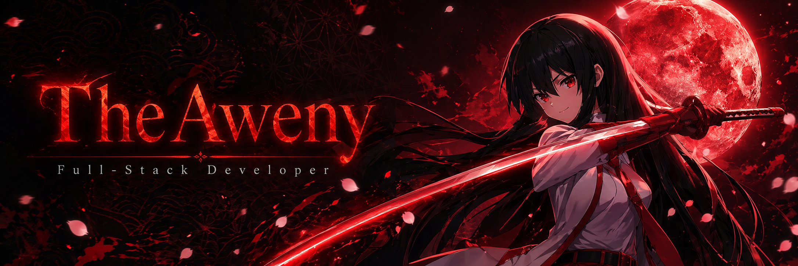

<div align="center">

<!-- Banner -->


<!-- TYPING ANIMATION -->
<a href="https://git.io/typing-svg">
  
</a>

<br/>


&nbsp;


</div>

---


### `~/whoami`

```typescript
const theAweny = {
  name:       "Aweny",
  pronouns:   "he/him",
  location:   "🇷🇺 Russia",
  role:       "Full-Stack Developer",
  os:         "Arch Linux + Hyprland 🐧",
  editor:     "VSCode, Zed",
  
  currentlyBuilding: [
    "Judex CLI (TS: Clack, Ink)",
    "Hotaru - Anime Streaming Service",
    "School info system (NestJS + Prisma + PostgreSQL)",
  ],
  
  learning:   ["Advanced NestJS patterns", "DevOps", "Rust (someday...)"],
  interests:  ["Self-hosted services", "Linux ricing"],
  waifu:      "Akame 🗡️",
};
```

<br clear="right"/>

---

## ⚔️ Tech Stack

<div align="center">

#### 🖥️ Backend


#### 🗄️ Databases & ORM


#### 🌐 Frontend


#### ⚙️ Infrastructure & Tools


#### 🛠️ Other


</div>

---

## 📊 Stats

<div align="center">


<br/><br/>


</div>

---

## 📈 Activity

<div align="center">

</div>

---

## 🐍 Contributions

<div align="center">
<picture>
  <source media="(prefers-color-scheme: dark)"  srcset="https://raw.githubusercontent.com/TheAweny/TheAweny/output/github-snake-dark.svg"/>
  <source media="(prefers-color-scheme: light)" srcset="https://raw.githubusercontent.com/TheAweny/TheAweny/output/github-snake.svg"/>
  
</picture>
</div>

---

## 🗡️ Featured Projects

<div align="center">

<a href="https://github.com/TheAweny/YOUR_REPO_1">
  
</a>
&nbsp;
<a href="https://github.com/TheAweny/YOUR_REPO_2">
  
</a>

</div>

---

## 📫 Contact

<div align="center">

[](https://t.me/TheAweny)
[](https://github.com/TheAweny)

</div>

---

<div align="center">


<sub>Built with Arch Linux, NestJS, and too much coffee ☕</sub>
</div>
